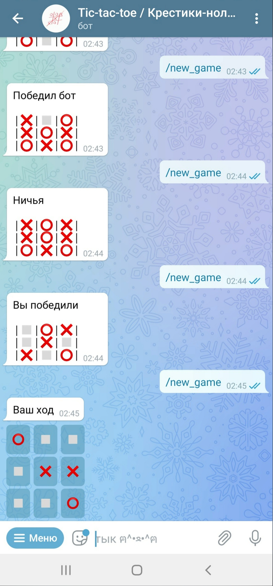
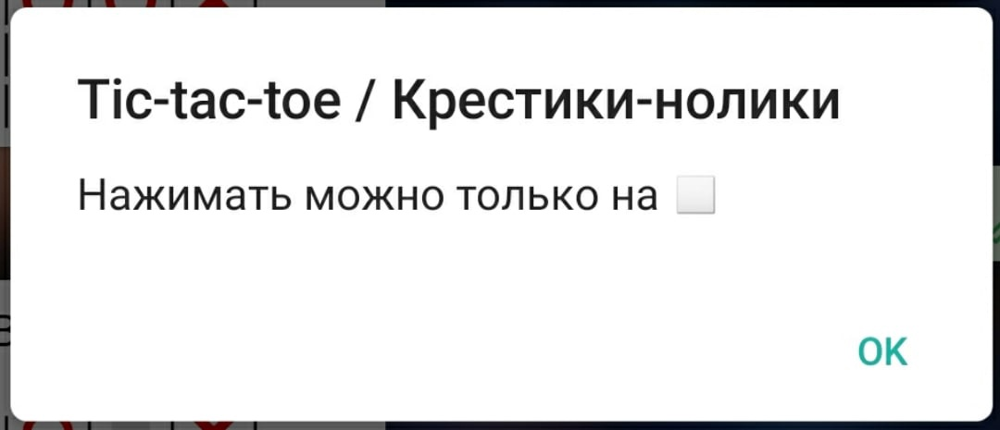

# Телеграм-бот для игры в крестики-нолики

Бот отвечает на команды:
* `/new_game` - запустить новую игру;
* `/help` - показать раздел "Помощь";
* `/start` - аналогичен `/help`, используется для инициализации бота.

При отправке любого текстового сообщения, будет выведен тот же ответ, что и на команду `/help`.



## Принцип работы

Для того, чтобы не использовать базу данных, бот работает исключительно с callBackData, которую получает при нажатии на кнопку. Для этого, каждая кнопка хранит в себе следующую строку следующего формата: `n?????????`, где
* `n` - номер кнопки,
* `?` - один из вариантов значения ячейки (смотри модуль strings, раздел "символы, которые используются")

Пример: `5❌❌⭕⭕❌❌◻◻❌` означает, что была нажата пятая кнопка, и текущий вид игрового поля:
```
❌❌⭕
⭕❌❌
◻◻❌
```

Пользователь играет за крестик, бот играет за нолик.
Бот проверяет, есть ли возможность сходить крестиком в ячейку, которую выбрал пользователь. Если возможности нет, то появится всплывающее уведомление:


Если ячейка, в которую хочет сходить пользователь свободна, то осуществляется ход, а затем выполняется проверка: не стал ли ход победным. Если нет, то наступает очередь бота ходить. Ячейка выбирается случайным образом, после чего проверяется не стал ли этот ход победным для бота. Дальше проверяется не получилась ли ничья, после чего редактируется сообщение.

После окончания игры кнопки пропадают, а на их месте появляется табличка с результатом партии.

## Установка и настройка

Для работы бота нужен токен. Чтобы его получить, необходимо написать телеграмм-боту [@BotFather](https://t.me/BotFather).
1) `/newbot` - команда для регистрации бота в телеграм.
2) после этого будет предложено написать имя бота, например `Tic-tac-toe / Крестики-нолики`.
3) дальше нужно выбрать username бота, то есть ссылку, по которой он будет доступен, например `Tic-tac-toeWith_bot` (такое имя выбрать не получится, т.к. оно уже занято, необходимо придумать уникальный username).

Если все действия были выполнены правильно, то [@BotFather](https://t.me/BotFather) пришлет текст, который будет содержать токен для работы бота:
`Use this token to access the HTTP API: <токен для работы бота>`

Далее создайте в папке проекта файл `token.txt` и поместите туда токен для работы телеграм бота.
> P.s. при сохранении на GitHub файл `token.txt` загружаться не будет, так как он добавлен в `.gitignore`. Это сделано для безопасности, чтобы никто не мог воспользоваться Вашим ботом.

Также для работы бота необходимо иметь установленную библиотеку [python-telegram-bot](https://python-telegram-bot.org/). Для её установки воспользуйтесь командой:
`pip install python-telegram-bot`